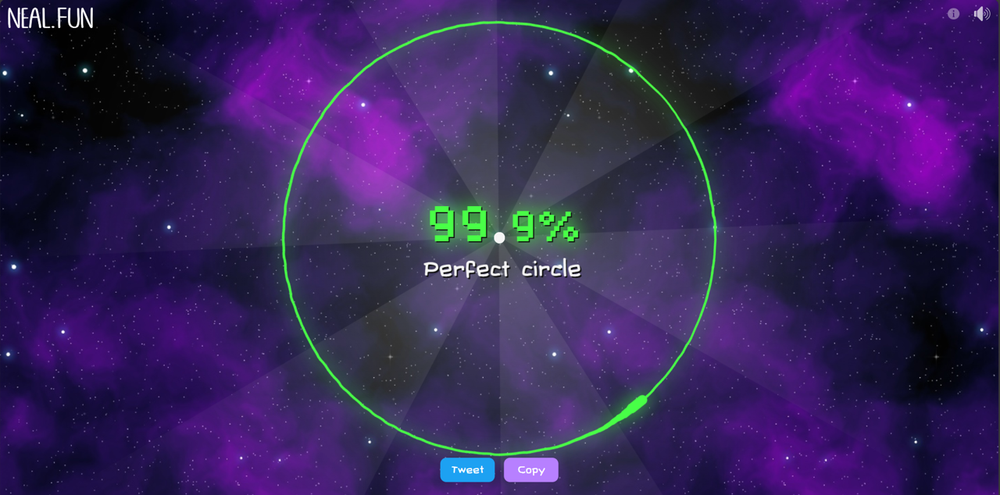

# perfect circle game

## Usecase

  there is a game on [neal.fun](https://www.neal.fun/), the [draw the perfect circle](https://neal.fun/perfect-circle/) game.

  In this game you need to draw a circle as perfect as possible.
  To automate this process I wrote this script.

## Usage

  In line 9 of the pythob file, you must take the icon number of your browser and replace the "1".
  Then you need to open your browser and make shure, the [draw the perfect circle](https://neal.fun/perfect-circle/) page is active.
  
  After that, start the python script.
  It will automatically switch to your browser and do two laps around the central dot

  BUT MAKE SHURE TO PRESS THE LEFT MOUSE BUTTON.
  Unfortunately I couldn't get that to work.

## In case you are wondering

  It is likely, that the score increases, if you add more points to the circle.
  But if you do so, make sure to minimize the delay. I'll mark the variables you can just change them in the code.

## Result

  

## Good luck and have fun beating the game
